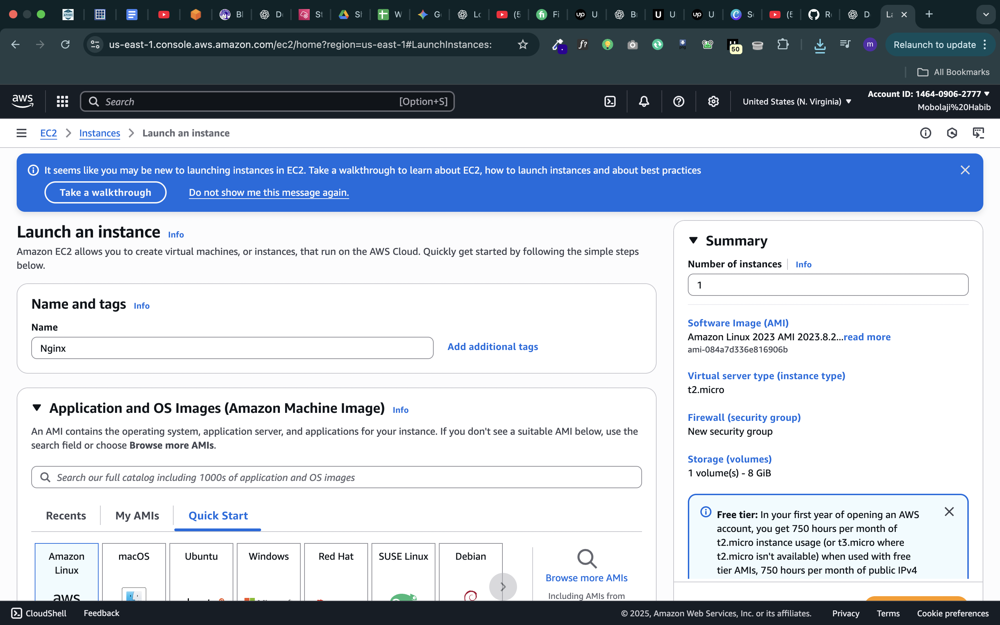
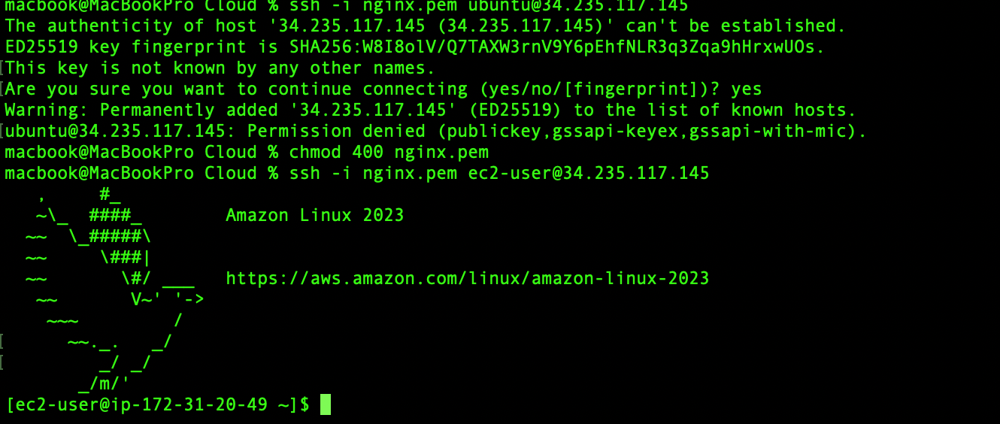
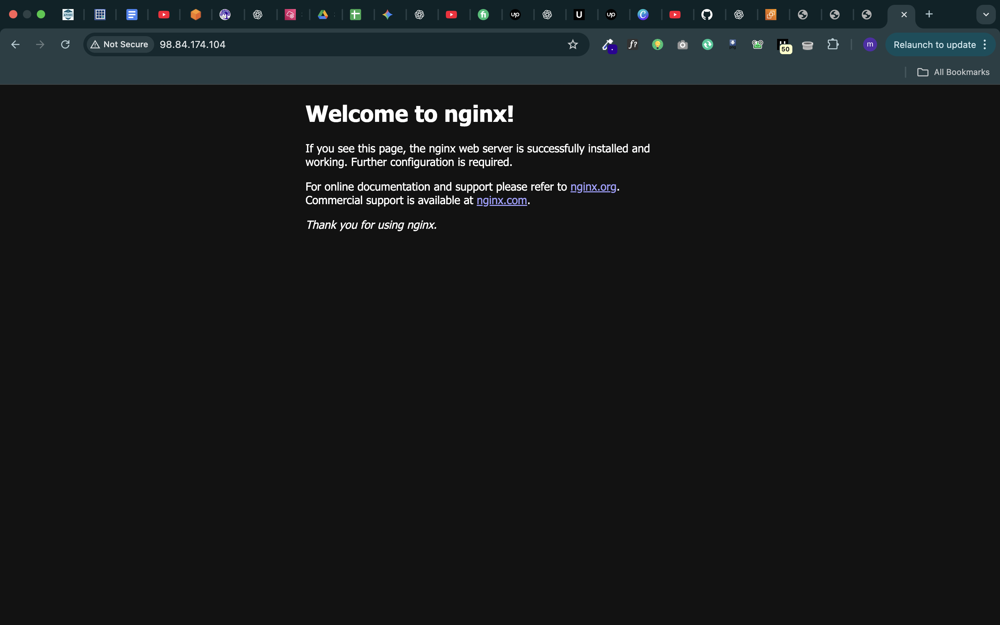
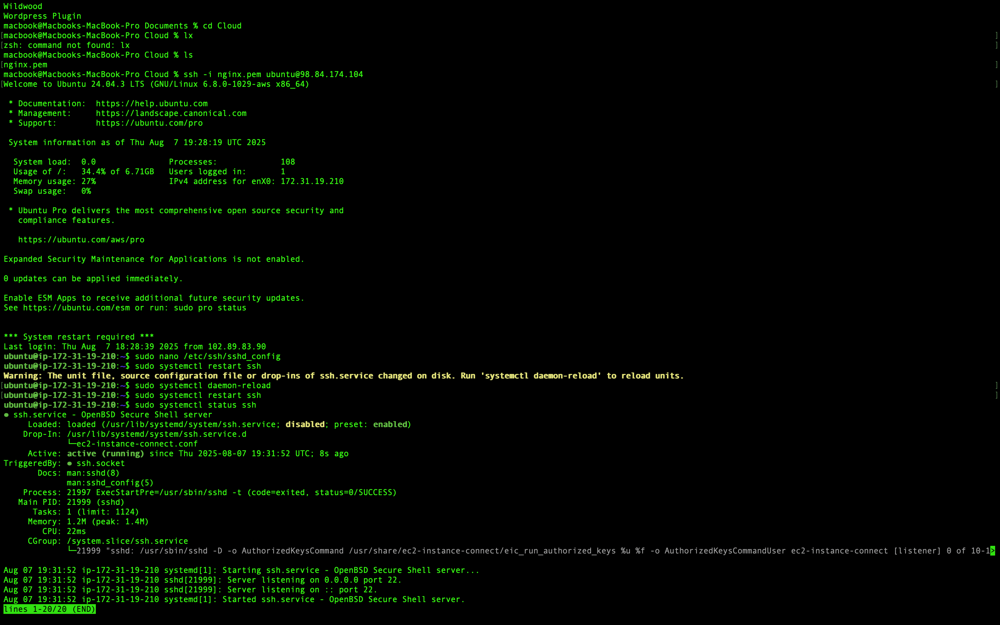
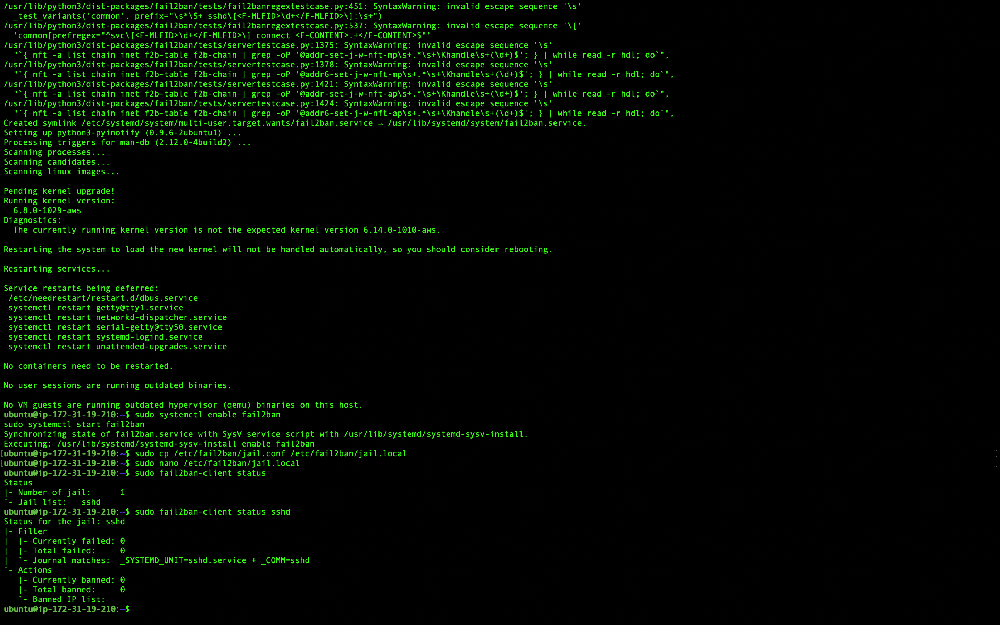

# ☁️ cloud-secure-webserver

## 🛠️ Secure EC2 Web Server Deployment (AWS + Ubuntu + NGINX)

This project walks through deploying and securing a web server on AWS EC2 using **Ubuntu 22.04**, **NGINX**, **UFW**, **Fail2Ban**, and **HTTPS via Let’s Encrypt**.

---

## 📚 Table of Contents

1. [Project Overview](#project-overview)  
2. [Tools & Technologies](#tools--technologies)  
3. [Architecture](#architecture)  
4. [Setup Instructions](#setup-instructions)  
   - [1. Launch EC2 Instance](#1-launch-ec2-instance)  
   - [2. Connect via SSH](#2-connect-via-ssh)  
   - [3. Install NGINX](#3-install-nginx)  
   - [4. Secure SSH Access](#4-secure-ssh-access)  
   - [5. Configure Firewall (UFW)](#5-configure-firewall-ufw)  
   - [6. Install Fail2Ban](#6-install-fail2ban)  
   - [7. Enable HTTPS (Let’s Encrypt)](#7-enable-https-lets-encrypt)  
5. [Validation](#validation)  
6. [Screenshots](#screenshots)  
7. [Lessons Learned](#lessons-learned)  

---


 🧠 Project Overview

This project simulates a real-world deployment and security hardening of a cloud server. You’ll go from launching an EC2 instance to securing it against brute-force attacks and enabling HTTPS.

Goals:
- Launch an Ubuntu EC2 instance
- Install and configure NGINX
- Enforce SSH key authentication
- Configure UFW firewall
- Protect SSH with Fail2Ban
- Enable HTTPS with Let’s Encrypt

---

## 🧰 Tools & Technologies

| Tool | Purpose |
|------|---------|
| AWS EC2 | Cloud virtual machine |
| Ubuntu 22.04 | Linux OS |
| NGINX | Web server |
| SSH Key | Remote login |
| UFW | Firewall |
| Fail2Ban | SSH brute-force protection |
| Let’s Encrypt + Certbot | TLS/SSL certificates |
| Git & GitHub | Version control |

----

 Setup Instructions

Each step below is broken into commands and reasoning.

1. Launch EC2 Instance
We begin by launching an EC2 instance using the AWS Management Console.

Configuration:
Name: secure-nginx-server
-AMI: Ubuntu Server 22.04 LTS (HVM)
- Instance Type:t2.micro (Free Tier)
-SSH Key Pair: A new key was created and downloaded for secure access.
- Security Group Rules:
  - SSH (port 22) — Only my IP
  - HTTP (port 80) — Open to all
  - HTTPS (port 443) — Open to all

This setup ensures we start with minimal exposure to threats, following the principle of least privilge.


️ Screenshot



2. Connect via SSH

Once the EC2 instance is running, we connect from our Mac using the SSH key.

 Steps:

1. Move the downloaded `.pem` file to a secure folder:
    ```bash
    mkdir -p ~/.ssh/aws
    mv ~/Downloads/secure-server.pem ~/.ssh/aws/
    chmod 400 ~/.ssh/aws/secure-server.pem
    ```

2. Connect to the server:
    ```bash
    ssh -i ~/.ssh/aws/secure-server.pem ubuntu@<your-ec2-public-ip>
    ```

> We use `chmod 400` to ensure the key isn’t publicly viewable — SSH will reject insecure key files.

 📸 SSH Connection Successful:

3. Install NGINX

After updating the system, we install the NGINX web server.

Commands:

bash
sudo apt install nginx -y
sudo systemctl start nginx
sudo systemctl enable nginx


5. Secure SSH Access


To strengthen our server’s security, we harden the SSH configuration.

Step 6: Setup UFW Firewall

UFW (Uncomplicated Firewall) is used to manage firewall rules in Ubuntu. It’s a simple and effective way to secure your server by controlling incoming and outgoing traffic.
  
bash
Copy
Edit
sudo ufw allow OpenSSH
sudo ufw allow 'Nginx HTTP'
sudo ufw enable
sudo ufw status
Note: Always allow SSH before enabling UFW, or you may lock yourself out of the server.

The output should show that OpenSSH and Nginx HTTP are allowed.


Step 6: Setup UFW Firewall

UFW (Uncomplicated Firewall) is used to manage firewall rules in Ubuntu. It’s a simple way to control incoming and outgoing network traffic.

Commands
# Allow SSH (important: do this first to avoid locking yourself out)
sudo ufw allow OpenSSH

# Allow Nginx HTTP traffic (port 80)
sudo ufw allow 'Nginx HTTP'

# Enable UFW
sudo ufw enable

# Check UFW status
sudo ufw status

Notes

Always allow SSH before enabling UFW, or you may lock yourself out of the server.

After enabling, the output should confirm that OpenSSH and Nginx HTTP are allowed.

Example Output
Status: active

To                         Action      From
--                         ------      ----
OpenSSH                    ALLOW       Anywhere
Nginx HTTP                 ALLOW       Anywhere
OpenSSH (v6)               ALLOW       Anywhere (v6)
Nginx HTTP (v6)            ALLOW       Anywhere (v6)


)


Step 6: Install Fail2Ban to Protect Against Brute-Force SSH Attacks

Reasoning:
SSH is one of the most common attack vectors for servers. Hackers often run automated scripts to guess passwords through repeated login attempts. Fail2Ban monitors log files for suspicious activity and automatically bans IPs that show malicious signs — such as too many failed login attempts. This reduces the risk of brute-force attacks.

Steps Taken:

Update package list

sudo apt update
Install Fail2Ban


sudo apt install fail2ban -y
Enable and start Fail2Ban service


sudo systemctl enable fail2ban
sudo systemctl start fail2ban
Copy default configuration for customization

sudo cp /etc/fail2ban/jail.conf /etc/fail2ban/jail.local
Configure SSH protection in /etc/fail2ban/jail.local

enabled = true
port = ssh
filter = sshd
logpath = /var/log/auth.log
maxretry = 
bantime = 
Restart Fail2Ban to apply changes

sudo systemctl restart fail2ban
Check Fail2Ban status


sudo fail2ban-client status
